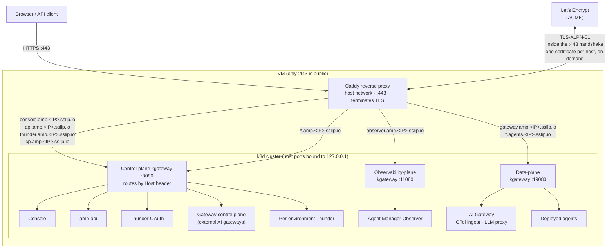
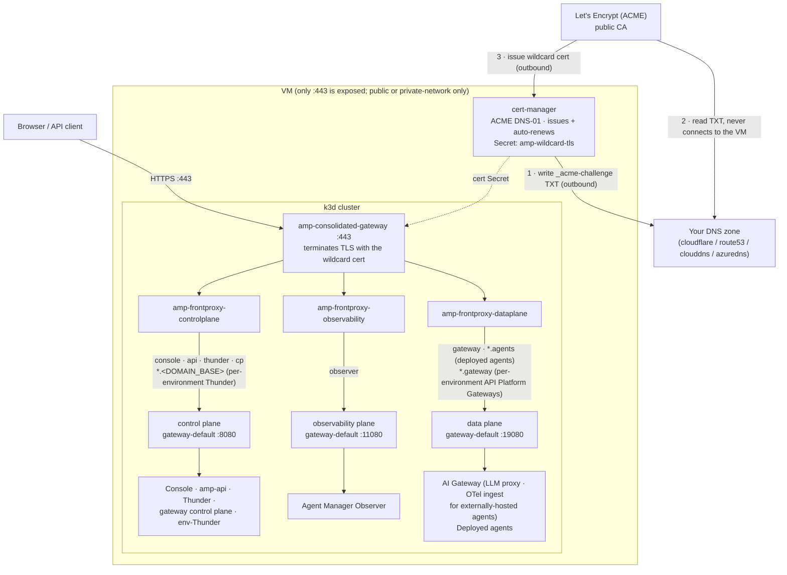
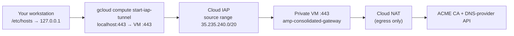

import Tabs from '@theme/Tabs';
import TabItem from '@theme/TabItem';

# Run Agent Manager on a VM with Docker

:::warning Not recommended for production use

Both installation paths on this page **Simple** and **Advanced** are intended for **evaluation, demos, and proof-of-concept** use only. Do not use them to run production workloads or to handle sensitive or regulated data.

For production, run Agent Manager on a properly operated Kubernetes platform with high availability, a managed and backed-up database, secret management, monitoring, and a hardened, redundant ingress following your organization's production practices. Use these installers to try Agent Manager out, not to run it for real.

:::

:::info Stronger agent isolation tiers
Agents run sandboxed under the standard **runc** runtime by default. Agent Manager also supports stronger per-environment isolation tiers, **gVisor** (userspace kernel) and **Kata Containers** (per-agent VM), but they have hardware/OS requirements and need a dedicated node. For more information, see the [gVisor](./isolation-tiers/gvisor.mdx) and [Kata Containers](./isolation-tiers/kata.mdx) setup guides.
:::

Install Agent Manager on a Linux VM where Docker is the only host dependency. Pick the path that fits you:

- **Simple**: give the installer the VM's public IP and it does everything else: hostnames are derived from the IP via [sslip.io](https://sslip.io) and TLS certificates are issued automatically by Let's Encrypt. No domain, no DNS setup, no certificate handling. Best for demos and quick evaluations.
- **Advanced**: a config-file-driven installer for a **custom domain**, on a VM that is either publicly reachable or **private-network-only**. TLS is a single wildcard certificate, obtained either way you prefer: cert-manager issues and auto-renews a publicly-trusted one through the ACME **DNS-01** challenge (Let's Encrypt by default, any ACME CA via `ACME_SERVER`), which needs outbound access only and so works on a private VM but requires a DNS zone you control on a supported provider (Cloudflare, Route 53, Cloud DNS, or Azure DNS); or you supply your own certificate, which needs no DNS credential and no reachable CA. Validates your config and certificate before installing, and reports whether your DNS points at the VM.

<Tabs groupId="vm-installer">
<TabItem value="simple" label="Simple (IP + automatic TLS)" default>

The simple installer exposes the platform over HTTPS using [sslip.io](https://sslip.io) hostnames derived from the VM's public IP, so there's no domain registration.

## Prerequisites

You need an SSH client to log into the VM. On the VM itself, install the tools below **before** running the installer. It **verifies** they are present and exits with install hints if any are missing; it does **not** install host tooling for you. The whole stack runs on Docker: k3d runs the Kubernetes cluster as Docker containers, and Caddy runs as a container.

| Tool | Version | Purpose |
| --- | --- | --- |
| [Docker](https://docs.docker.com/engine/install/) | v26+ (8 GB RAM, 4 CPU) | Container runtime |
| [k3d](https://k3d.io/#installation) | v5.8+ | Local Kubernetes cluster |
| [kubectl](https://kubernetes.io/docs/tasks/tools/#kubectl) | v1.33+ | Kubernetes CLI |
| [Helm](https://helm.sh/docs/intro/install/) | v3.12+ | Package manager |

`curl` and `lsof` are also required. They are usually preinstalled, but on a minimal image install them with your OS package manager (for example `sudo apt-get install -y curl lsof`).

Verify everything is installed:

```bash
docker --version
k3d --version
kubectl version --client
helm version --short
```

Verify the Docker daemon is running:

```bash
docker info > /dev/null
```

The VM also needs:
- A **static (reserved) public IP** and SSH access (sudo). The install derives every hostname, TLS certificate, and OAuth issuer from the IP (`*.amp.<IP>.sslip.io`), so a **changing IP breaks the install**, and stopping the VM (for example to resize its disk) releases an ephemeral IP. Reserve the address before installing. If the IP ever changes, reinstall against the new IP.
- **At least 50 GB of disk.** Building and running agents pushes the in-cluster image store past 13 GB; on a smaller disk the node hits `DiskPressure`, which evicts pods and can take cluster DNS down mid-build.
- **Inbound `443/tcp` open** in the cloud security group / firewall, and only 443. Certificates issue via the TLS-ALPN-01 ACME challenge, which runs inside the `:443` TLS handshake, so no inbound port 80 is ever needed. The `:443` exposure must be **TCP passthrough** (not a TLS-terminating load balancer in front), since the challenge happens inside the handshake.

## Install

SSH into the VM and run the one-command installer with `sudo`. It downloads a single versioned install bundle (no repository clone) and runs from it:

```bash
# on the VM (Docker, k3d, kubectl, helm already installed)
curl -fsSL https://github.com/wso2/agent-manager/releases/download/amp/v1.0.0-rc3/bootstrap.sh \
  | sudo bash -s -- simple \
      --host <VM_PUBLIC_IP> \
      --version 1.0.0-rc3 \
      --email you@example.com
```

Pass `--host` the VM's **public** IPv4 address. A cloud VM usually can't read its own public IP (it's NAT'd behind the address you used to SSH in), so the installer needs it to build the `*.amp.<IP>.sslip.io` hostnames.

The installer runs in two phases: preflight (verify the required tools + open the firewall) and the platform install + Caddy startup. Allow 8-15 minutes. It needs `sudo` because it opens the firewall and creates the cluster. Downloading one bundle instead of cloning the repo and fetching each file separately avoids the GitHub rate-limiting that can throttle a per-file install.

### Options

| Flag | Default | Purpose |
|---|---|---|
| `--host` | _(required)_ | The VM's public IPv4 address |
| `--version` | _(required)_ | Agent Manager release to install; an existing `amp/v*` [release](https://github.com/wso2/agent-manager/releases) (the `bootstrap.sh` URL embeds the same version) |
| `--email` | _(none)_ | ACME contact for expiry notices |
| `--no-external-gateways` | off | Drop the gateway control-plane endpoint if you won't connect external gateways |

## What gets exposed

The installer fronts the stack with [Caddy](https://caddyserver.com), an open-source web server that terminates TLS, obtains and renews Let's Encrypt certificates automatically, and reverse-proxies each public hostname to the right service. It runs as a single `amp-caddy` Docker container and is the only process listening on the internet-facing ports.

Only `:443` faces the internet; all other service ports are bound to the VM's loopback and reached only by Caddy.



Every public hostname resolves to the VM's IP (via sslip.io) and arrives at Caddy on `:443`; Caddy terminates TLS and reverse-proxies to the matching loopback port. The Agent Manager services are ClusterIP inside the cluster: Caddy forwards the console, API, Thunder, gateway-control-plane, and per-environment Thunder hosts to the OpenChoreo control-plane kgateway (loopback `:8080`), the observer host to the observability-plane kgateway (loopback `:11080`), and the OTel-ingest host plus the deployed-agent wildcard to the data-plane kgateway (loopback `:19080`). Each gateway routes by the preserved `Host` header. Certificates are obtained over that same `:443` using the TLS-ALPN-01 challenge, so no inbound port 80 is needed.

Every certificate here is issued **on demand**, one per concrete hostname, at the first handshake to it. That is forced by the wildcard sites: TLS-ALPN-01 cannot issue a wildcard certificate, and Caddy will not eagerly issue for a name a wildcard it manages already covers — which `*.amp.<IP>.sslip.io` does for every fixed host. The difference between the tiers is only whether the installer can walk them first: it knows the six fixed hosts, so it requests their certificates at the end of the install, which is why the console is normally ready by the time you open it. That walk is best effort — a request that fails is logged and does not stop the install, leaving that host on the same first-request path as the dynamic ones below. The other two tiers are **dynamic** — a new host appears the first time you deploy into a new org/project, and each time you create an environment — so they cannot be pre-warmed, and their first request is the one that triggers issuance.

| URL | Purpose |
|---|---|
| `https://console.amp.<IP>.sslip.io` | Console UI |
| `https://api.amp.<IP>.sslip.io` | Agent Manager API (used by `amctl`) |
| `https://thunder.amp.<IP>.sslip.io` | Thunder OAuth (login) |
| `https://<handle>.amp.<IP>.sslip.io` | Per-environment Thunder (one unguessable host per environment, created on demand) |
| `https://observer.amp.<IP>.sslip.io` | Agent Manager Observer |
| `https://gateway.amp.<IP>.sslip.io/otel` | OTel trace ingest for **externally-hosted** agents (see below) |
| `https://<org>-<project>.agents.<IP>.sslip.io/...` | Deployed-agent invocation endpoints (one wildcard host per org/project) |
| `https://cp.amp.<IP>.sslip.io` | Gateway control plane; connect external gateways here (on by default) |

:::note Agents deployed on this VM do not use the public OTel host
`gateway.amp.<IP>.sslip.io/otel` exists for agents running **outside** the platform, which set [`AMP_OTEL_ENDPOINT`](./amp-instrumentation.mdx) themselves. Agents deployed by Agent Manager run inside the cluster and export their traces straight to the in-cluster gateway runtime instead, so their traffic never leaves the VM or passes through Caddy.
:::

## Log in

Open `https://console.amp.<IP>.sslip.io` and sign in with the seeded admin user **`admin`** (password **`admin`**). This user holds the `Agent Manager Admin` role, which grants full administrative permissions for both console and API access.

The **`admin`** account is provisioned with the `Agent Manager Admin` role during bootstrap, so API calls are authenticated and authorized. Use the same credentials for both console login and API access via Bearer token authentication.

## Deployed-agent invocation

When you deploy an agent, its endpoint is published on a per-project host `<org>-<project>.agents.<IP>.sslip.io` and routed by Caddy to the OpenChoreo data-plane gateway. Because these hostnames are dynamic (a new one per org/project), Caddy issues their TLS certificates **on demand** at the first request — the same path the fixed hosts take, without the install-time pre-warm that spares those the wait. Invocations are authenticated with a user token that the gateway validates against the public Thunder issuer.

Because issuance is on demand and uses TLS-ALPN-01 (the challenge runs inside the `:443` handshake), the **very first request to a newly-deployed agent host can fail with a one-time certificate error**. That first connection is consumed by Caddy answering the ACME challenge, so the client briefly sees the challenge certificate instead of the real one. Every client hits this; only the wording differs. Chromium-based browsers (Chrome, Edge, Brave) report `ERR_CERTIFICATE_TRANSPARENCY_REQUIRED`, while other browsers and command-line clients report their own untrusted-certificate error. Issuance completes within a second or two; reload the page (or open it in a fresh tab) and it serves the trusted Let's Encrypt certificate. This only affects the first hit per new agent host; the certificate is then cached in the `amp-caddy-data` volume.

The same applies to the per-environment Thunder hosts (`<handle>.amp.<IP>.sslip.io`): they are created when you add an environment and get their certificates on demand the same way, so the first request to a brand-new environment's Thunder can show the same one-time error.

amp-api advertises each agent endpoint with the `https://` scheme (the installer sets `tlsEnabled` on the service), so the console (and any other caller) invokes it over TLS directly through the wildcard site.

## TLS

Caddy obtains and auto-renews trusted Let's Encrypt certificates with no manual certificate steps. Issuance is per hostname and on demand (see [What gets exposed](#what-gets-exposed)); the installer pre-warms the six fixed hosts once Caddy is up, so the URLs it prints usually work on the first click. A pre-warm that fails is logged rather than fatal, and that host's certificate is then obtained at its first request instead. Issuance uses the **TLS-ALPN-01** challenge, which runs inside the `:443` TLS handshake, so only inbound 443 is ever required and there is no port-80 dependency. Certificates and the ACME account persist in the `amp-caddy-data` Docker volume, so restarts do not re-request them.

Because the challenge happens inside the TLS handshake, the public `:443` must reach Caddy as **raw TCP**; do not put a TLS-terminating load balancer in front of the VM. There is no `:80` listener, so plain `http://` URLs are not served (no automatic http→https redirect); always use the `https://` URLs the installer prints.

## Persistence and teardown

Application data (PostgreSQL), issued certificates, and the k3d cluster persist across Docker/host restarts via named volumes. Everything the installer created lives either inside the k3d cluster or in the Caddy container and its two volumes, so tearing down is the three commands below, plus one optional cleanup:

```bash
sudo k3d cluster delete amp-local                        # delete the cluster (workloads + app data)
sudo docker rm -f amp-caddy                              # remove the Caddy front door
sudo docker volume rm amp-caddy-data amp-caddy-config    # drop the cached certs + ACME account

sudo rm -f /opt/amp/Caddyfile                            # optional: the generated Caddy config
```

Use `sudo`; the installer runs Docker and k3d as root. Note that the installer leaves no repository checkout on the VM, because `bootstrap.sh` unpacks the versioned bundle into a temporary directory and deletes it on exit. Teardown is therefore done with the commands above rather than an uninstall script. Deleting the cluster removes the platform's data; deleting the Caddy volumes discards the issued certificates and the ACME account, so a reinstall re-requests them from Let's Encrypt (which counts against its rate limits).

## Connect an external gateway

Agent Manager can drive external WSO2 AI gateways. The control-plane endpoint `https://cp.amp.<IP>.sslip.io` is exposed by default for this. In the console, open **Infrastructure → Gateways**, generate a registration token, and follow the generated commands, which point the gateway at `cp.amp.<IP>.sslip.io:443`, where it opens a control WebSocket and pulls its configuration. If you do not need external gateways, install with `--no-external-gateways` to drop this endpoint.

**Security:** the registration token grants a gateway your LLM-provider API keys and proxy credentials. Treat it as a secret, revoke/regenerate it from the Gateways page when a gateway is decommissioned, and optionally restrict `cp.amp...` to known gateway source IPs at the firewall.

## Troubleshooting

- **Certificates never issue / hosts unreachable from outside.** Open inbound `:443` in your cloud security group / NACL, and make sure the public `:443` reaches the VM as **raw TCP**: a TLS-terminating load balancer in front breaks the TLS-ALPN-01 challenge. The installer can't verify external reachability from inside the VM, so this surfaces as Caddy failing to obtain certificates (`docker logs amp-caddy`).
- **Certificate not issued.** Check `docker logs amp-caddy`. Let's Encrypt rate limits on sslip.io are high but not infinite; if hit, retry shortly.
- **Login redirect mismatch.** Confirm you reached the console via its `console.amp.<IP>.sslip.io` URL, not the raw IP.
- **Certificate error on first agent invocation** (`ERR_CERTIFICATE_TRANSPARENCY_REQUIRED` in Chromium-based browsers, an untrusted-certificate warning elsewhere): the per-agent certificate is issued on demand, and the first request races with that issuance. Reload the page after a second or two; it only happens once per new agent host (see [Deployed-agent invocation](#deployed-agent-invocation)).

</TabItem>
<TabItem value="advanced" label="Advanced">

The advanced installer (`install-advanced.sh`) is config-file driven and runs **on the VM** with `sudo`. Use it when you have your own domain. It terminates TLS on `:443` at a single in-cluster gateway, and gives you two ways to obtain the certificate that gateway serves:

- **`TLS_MODE=dns01`** (the default) — cert-manager issues a **publicly-trusted** certificate via the ACME **DNS-01** challenge and auto-renews it. You supply a DNS-provider API credential; the VM needs outbound access to the ACME and provider APIs.
- **`TLS_MODE=byoc`** — you supply the certificate and key ([Bring your own certificate](#adv-byoc)). No ACME, no DNS-provider credential, and no outbound access to a CA, so this also covers air-gapped VMs and certificates from a corporate PKI. Nothing auto-renews, so you rotate it yourself.

Everything downstream of the certificate is identical in both modes. Neither mode needs inbound access for issuance, so both work whether the VM is **public** or reachable only from a **private network**.

Setup is the same for both up to and including the install; only how clients reach the VM differs. Work through [Prerequisites](#adv-prerequisites), [Configure](#adv-configure), and [Install](#adv-install), then switch the **Public network / Private network** selector below to the one matching your VM. Everything after that selector applies to both again.

If you just want a quick IP-based demo with automatic TLS, prefer the **Simple** tab.

## Prerequisites {#adv-prerequisites}

- **Docker, k3d, kubectl, Helm, curl, and `lsof`** must already be installed on the VM. The installer **verifies** they are present and exits with install hints if any are missing. It does **not** install them for you.
- A **Linux VM** with at least **4 vCPUs**, **8 GB RAM**, and **50 GB of disk**, and **outbound** internet access to pull images and charts. Inbound `:443` is needed only for clients to reach the services, **not** for certificate issuance, so a fully private VM works. Those figures cover the platform plus the **default environment**. Every environment you add runs its own Thunder and API Platform Gateway, and evaluation runs are scheduled as extra pods, so on 4 vCPUs a second environment can consume nearly all allocatable CPU — after which evaluation jobs stay `Pending` (`0/1 nodes are available: 1 Insufficient cpu`) instead of reporting a capacity error. Plan on **8 vCPUs** if you intend to add environments or run evaluations.
- **A domain you control.** With `TLS_MODE=dns01` it must additionally be hosted on one of the supported DNS providers — **Cloudflare**, **AWS Route 53**, **Google Cloud DNS**, or **Azure DNS** — and you need **a DNS-provider API credential** scoped to edit that zone's records, which cert-manager uses to write the `_acme-challenge` TXT record. You do **not** create TXT records by hand. With `TLS_MODE=byoc` neither the provider nor the credential matters; you need only [a certificate covering the right names](#adv-byoc).

## Configure {#adv-configure}

The config file is plain shell, one `KEY=value` assignment per line. Generate an annotated template with `install-advanced.sh --init` (see [Install](#adv-install) for how to get the script), then fill in the keys below. Keep the file `chmod 600`: it holds your DNS-provider credential.

| Key | Required | Purpose |
|---|---|---|
| `AMP_VERSION` | yes | Agent Manager release to install (an `amp/v*` [release](https://github.com/wso2/agent-manager/releases)) |
| `DOMAIN_BASE` | yes | Base domain; service hosts are derived as `<svc>.<DOMAIN_BASE>` |
| `TLS_MODE` | no | `dns01` (default) or `byoc`. Omitting it keeps the cert-manager DNS-01 behaviour |
| `ACME_EMAIL` | dns01 | ACME account contact; cert-manager registers the account with it |
| `DNS_PROVIDER` | dns01 | `cloudflare`, `route53`, `clouddns`, or `azuredns`; supply that provider's credentials below |
| `ACME_SERVER` | no | Override the ACME directory (e.g. Let's Encrypt **staging**) while testing, to avoid rate limits |
| `TLS_CERT_FILE` / `TLS_KEY_FILE` | byoc | Paths on the VM to your certificate chain and its private key, both PEM |
| `TLS_CA_FILE` | no | Only for `byoc` with a **private** CA: the CA certificate, so in-cluster components trust it |
| `EXTERNAL_GATEWAYS` | no | `true` (default) exposes the `cp` endpoint for external data-plane gateways |
| `HOST_CONSOLE`, `HOST_API`, `HOST_THUNDER`, `HOST_OBSERVER`, `HOST_GATEWAY`, `HOST_CP` | no | Override an individual service hostname (default `<svc>.<DOMAIN_BASE>`) |
| `AGENTS_BASE` | no | Base for deployed-agent hostnames (default `agents.<DOMAIN_BASE>`) |

With `DOMAIN_BASE=amp.mycompany.com`, the derived hosts are `console.amp.mycompany.com`, `api.amp.mycompany.com`, `thunder.amp.mycompany.com`, `observer.amp.mycompany.com`, `gateway.amp.mycompany.com`, and `cp.amp.mycompany.com`, plus three dynamic tiers: deployed agents at `<org>-<project>.agents.amp.mycompany.com`, per-environment Thunder at `<handle>.amp.mycompany.com` (one unguessable host directly under the base domain per environment — no fixed subdomain segment in between), and per-environment API Platform Gateways at `<env>-<org>.gateway.amp.mycompany.com`. cert-manager issues one **wildcard** certificate covering all of them, so there are no per-host certificate steps.

When you create an environment, you may supply its **Identity Service Handle**;
otherwise Agent Manager generates one. Treat the `Issuer:` value printed by the
provisioning command as the source of truth. Do not reconstruct the public
Thunder hostname from the organization and environment names.

### DNS provider credentials (`dns01`) {#adv-dns-provider}

Add the block for your provider to `amp-config.env`. Only the credential is secret; keep the file `chmod 600`.

Cloudflare (a scoped **Zone → DNS → Edit** API token):

```sh
DNS_PROVIDER=cloudflare
CLOUDFLARE_API_TOKEN=<token>
```

AWS Route 53 (IAM access key with `route53:ChangeResourceRecordSets` on the zone):

```sh
DNS_PROVIDER=route53
AWS_ACCESS_KEY_ID=<access-key-id>
AWS_SECRET_ACCESS_KEY=<secret-access-key>
AWS_REGION=us-east-1
```

Google Cloud DNS (service-account key file readable on the VM):

```sh
DNS_PROVIDER=clouddns
GCP_PROJECT=my-gcp-project
GCP_SERVICE_ACCOUNT_FILE=/opt/amp/gcp-dns-sa.json
```

Azure DNS (service principal):

```sh
DNS_PROVIDER=azuredns
AZURE_TENANT_ID=<tenant-id>
AZURE_CLIENT_ID=<client-id>
AZURE_CLIENT_SECRET=<client-secret>
AZURE_SUBSCRIPTION_ID=<subscription-id>
AZURE_RESOURCE_GROUP=<zone-resource-group>
```

### Bring your own certificate (`byoc`) {#adv-byoc}

Use this when you already hold a certificate — purchased, issued by your corporate PKI, or obtained by an ACME client you run elsewhere — or when the VM cannot reach a public CA or your DNS provider's API at all. The installer loads your certificate and key into the same Kubernetes Secret the DNS-01 path would have cert-manager issue, so the gateway, routes, and everything downstream behave identically.

The certificate must carry **every** name this install serves as a SAN:

| SAN | Covers |
|---|---|
| `console.<DOMAIN_BASE>` | Console |
| `api.<DOMAIN_BASE>` | Agent Manager API |
| `thunder.<DOMAIN_BASE>` | Platform Thunder (OAuth) |
| `observer.<DOMAIN_BASE>` | Observer |
| `gateway.<DOMAIN_BASE>` | AI Gateway (LLM proxy, OTel ingest) |
| `cp.<DOMAIN_BASE>` | Gateway control plane (omit if `EXTERNAL_GATEWAYS=false`) |
| `*.agents.<DOMAIN_BASE>` | Deployed agents |
| `*.<DOMAIN_BASE>` | Per-environment Thunder — handles sit directly under the base domain (no fixed subdomain segment), so this broader wildcard is what actually covers them, not a narrower `*.thunder.<DOMAIN_BASE>` |
| `*.gateway.<DOMAIN_BASE>` | Per-environment API Platform Gateways |

:::warning Three separate wildcards are required — none of them substitute for another
A wildcard matches exactly one label. `*.amp.mycompany.com` covers `console.amp.mycompany.com` and any single-label host directly under the base domain (including env-Thunder's handle-based hosts) — but it does **not** reach `myorg-myproject.agents.amp.mycompany.com` or `myenv-myorg.gateway.amp.mycompany.com`, which sit one level deeper. All three of `*.agents`, `*.<DOMAIN_BASE>`, and `*.gateway` must appear in the certificate literally, and unlike the `dns01` path there is no ACME to issue per-host certificates on demand.

This is the certificate-side counterpart of the DNS wildcard trap described under [How clients reach the VM](#adv-reachability) — the same one-label rule, biting in a different layer.
:::

The installer checks all of this **before** it touches the cluster, and fails naming the specific problem: a missing SAN, a key that doesn't match the certificate, or an expired certificate. Run `--dry-run` to print the required SANs next to the ones your certificate actually carries.

A self-signed certificate covering every tier, if you are testing or running an internal-only deployment:

```bash
D=amp.mycompany.com
openssl req -x509 -newkey rsa:2048 -nodes -days 365 \
  -keyout privkey.pem -out fullchain.pem -subj "/CN=$D" \
  -addext "subjectAltName=DNS:console.$D,DNS:api.$D,DNS:thunder.$D,DNS:observer.$D,DNS:gateway.$D,DNS:cp.$D,DNS:*.agents.$D,DNS:*.$D,DNS:*.gateway.$D"
```

Then point the installer at the certificate and key:

```sh
AMP_VERSION=<AMP_VERSION>
DOMAIN_BASE=amp.mycompany.com
TLS_MODE=byoc
TLS_CERT_FILE=/opt/amp/certs/fullchain.pem
TLS_KEY_FILE=/opt/amp/certs/privkey.pem
```

`TLS_CERT_FILE` should be the **full chain** (leaf plus any intermediates). A leaf-only file makes clients that don't already hold the intermediate fail to validate, which typically shows up as some clients working and others not.

#### Certificates from a private CA

If your certificate chains to a corporate CA rather than a public one, also set `TLS_CA_FILE` to that CA certificate:

```sh
TLS_CA_FILE=/opt/amp/certs/corporate-ca.pem
```

This matters more than it looks. Per-environment Thunder fetches platform Thunder's JWKS over `https://thunder.<DOMAIN_BASE>`, which goes back through the same `:443` gateway. Without the CA, that fetch fails on an untrusted chain and **logging in to an agent environment breaks**, even though the console and every other host look completely healthy.

The installer stores the CA in the cluster as the ConfigMap `amp-platform-ca` (namespace `openchoreo-control-plane`). That is what makes the setting durable: environments are created long after the install finishes, and each one provisions its own Thunder that has to validate the same HTTPS endpoint. Every later environment reads the CA from there automatically, so there is nothing extra to pass when you add one.

Browsers and API clients are a separate matter: they still need the CA in their own trust stores, which is a distribution problem the installer cannot solve for you.

:::note Adding environments to an install that did not set `TLS_CA_FILE`
If you installed with a private-CA certificate but no `TLS_CA_FILE`, environments created afterwards fall back to the cluster's own self-signed root — the wrong CA — and their Thunder cannot validate the JWKS URL. The environment is still reported as created successfully; only the login fails. Create the ConfigMap and re-add the environment:

```bash
kubectl create configmap amp-platform-ca -n openchoreo-control-plane \
  --from-file=ca.crt=/opt/amp/certs/ca.pem \
  --dry-run=client -o yaml | kubectl apply -f -
```
:::

:::warning `byoc` certificates are never renewed automatically
cert-manager renews the `dns01` certificate in-cluster with no involvement from you. Nothing does that for `byoc`. When the certificate expires, **every** host stops working at once — console, API, login, and deployed agents. Track the expiry date yourself and see [Persistence and teardown](#adv-persistence) for the rotation command, which does not require a reinstall.
:::

## How TLS and routing work {#adv-tls}

With `TLS_MODE=dns01`, cert-manager (installed in the cluster) runs the ACME DNS-01 challenge, issues one **wildcard certificate** into a Kubernetes Secret, and auto-renews it. With `TLS_MODE=byoc` the installer writes your certificate and key into that same Secret and creates no cert-manager objects at all — in the diagram below, the gateway and everything under it are unchanged and only the three numbered ACME steps disappear.

Routing uses a **front-proxy** model. A single consolidated Gateway (`amp-consolidated-gateway`) is the only thing listening on `:443`; it terminates TLS with the wildcard certificate and then forwards **by `Host` header** to each plane's own `gateway-default` gateway, which keeps its native routes. Three HTTPRoutes do the forwarding, and because two of the planes live in other namespaces, each cross-namespace hop is authorised by a ReferenceGrant.



The three wildcard routes matter because those tiers are **dynamic**: deploying into a new org/project adds a `<org>-<project>.agents.<DOMAIN_BASE>` host (agents in an existing project share theirs); each environment you create adds a `<handle>.<DOMAIN_BASE>` host (an unguessable handle, sitting directly under the base domain with no fixed subdomain segment in between); and each API Platform Gateway you register adds a `<env>-<org>.gateway.<DOMAIN_BASE>` host. `*.agents.<DOMAIN_BASE>`, `*.<DOMAIN_BASE>`, and `*.gateway.<DOMAIN_BASE>` are matched by the front-proxy routes and covered by the wildcard certificate up front, so nothing has to be re-issued or re-attached after install.

Note that `gateway.<DOMAIN_BASE>/otel` carries traces only from agents hosted **outside** the platform, which set [`AMP_OTEL_ENDPOINT`](./amp-instrumentation.mdx) themselves. Agents deployed by Agent Manager export straight to the in-cluster gateway runtime, so their traces never reach the `:443` listener at all.

## Install {#adv-install}

Download and unpack the versioned install bundle, then generate an annotated config template with `--init`:

```bash
# on the VM
VER=<AMP_VERSION>   # e.g. an amp/v* release tag, without the "amp/v" prefix
curl -fsSL "https://github.com/wso2/agent-manager/releases/download/amp/v${VER}/wso2-agent-manager-${VER}.tar.gz" | tar xz
deployments/vm/install-advanced.sh --init > amp-config.env
chmod 600 amp-config.env
```

Edit `amp-config.env` with the keys from [Configure](#adv-configure), then validate and preview without touching the cluster:

```bash
sudo deployments/vm/install-advanced.sh --config amp-config.env --dry-run
```

The dry run loads the config, runs the advisory DNS check, and prints the derived hosts, the required certificate SAN list, the helm overrides, and every TLS and gateway resource it would apply. It never contacts the cluster, and it redacts secrets — the DNS-provider credential in `dns01`, the certificate and key in `byoc`. In `byoc` mode it also validates your certificate and prints the SANs it actually carries beside the required list, so a mismatch surfaces here rather than after a 20-minute install. When it looks right, run the real install:

```bash
sudo deployments/vm/install-advanced.sh --config amp-config.env
```

The installer runs in three phases: preflight (verify tools + firewall, and in `byoc` mode validate the certificate), platform install, and TLS (obtain or install the certificate, then the consolidated gateway serves `:443`). Allow 15-20 minutes, plus a few minutes for issuance in `dns01` mode. It needs `sudo` because it opens the firewall and creates the cluster. On completion it prints the access URLs.

There are **no per-setting command-line flags** on the advanced path; everything comes from the config file.

:::tip Use Let's Encrypt staging first (`dns01` only)
Set `ACME_SERVER=https://acme-staging-v02.api.letsencrypt.org/directory` for your first run. Staging exercises the entire DNS-01 flow but has far looser rate limits than production, which enforces a weekly cap per registered domain that is easy to burn through while iterating. The staging certificate is **not** publicly trusted, so browsers and `curl` will warn, which is expected. Once a staging run succeeds end to end, remove `ACME_SERVER` (or point it at production), delete the cluster, and reinstall for a trusted certificate.

If you opened the console in a browser while the staging certificate was being served and clicked through the warning, clear that decision after switching to production. Browsers remember the approval for the rest of the session and keep reporting the page as insecure even once the trusted certificate is in place. Chrome shows "active content with certificate errors" while simultaneously reporting the certificate itself as valid and trusted. Quit **every** window of that browser profile (for an incognito window, closing one tab is not enough, because the session survives until all incognito windows are closed) and reopen it.
:::

If you prefer a single command and already have `amp-config.env`, `bootstrap.sh` downloads the bundle and runs the same installer for you:

```bash
curl -fsSL "https://github.com/wso2/agent-manager/releases/download/amp/v${VER}/bootstrap.sh" \
  | sudo bash -s -- advanced --config amp-config.env
```

Note that `bootstrap.sh` cannot emit the template, because it needs a version before it can download the bundle. Use the `--init` flow above to create the config.

## How clients reach the VM {#adv-reachability}

The install is identical either way; what differs is DNS and how you get a browser to the console. Pick the one that matches your VM. The sections after this apply to both.

<Tabs groupId="vm-network">
<TabItem value="public" label="Public network" default>

Use this when the VM has a public IP and clients reach it directly over the internet.

Open inbound **`443/tcp` only** in your cloud security group or firewall. Nothing else needs to be reachable: certificate issuance is egress-only, and every service is multiplexed behind the single `:443` listener by `Host` header.

### DNS records {#adv-dns-records}

Certificate issuance itself needs **no A records** — in `dns01` mode cert-manager proves control of the zone by writing the `_acme-challenge` TXT record through your provider credential, and `byoc` proves nothing at all. A records exist only so clients can **reach** the services. Point them at the VM's public IP:

```
*.amp.mycompany.com          A  <VM_PUBLIC_IP>   # console/api/thunder/observer/gateway/cp/per-environment Thunder
gateway.amp.mycompany.com    A  <VM_PUBLIC_IP>   # explicit, see the warning below
*.gateway.amp.mycompany.com  A  <VM_PUBLIC_IP>   # per-environment API Platform Gateways
*.agents.amp.mycompany.com   A  <VM_PUBLIC_IP>   # deployed agents
```

:::warning `gateway.<DOMAIN_BASE>` needs its own explicit A record
A DNS wildcard never matches a name that already exists as a node in the zone ([RFC 4592](https://datatracker.ietf.org/doc/html/rfc4592#section-2.2.1)). Creating `*.gateway.amp.mycompany.com` (needed for the per-environment API Platform Gateway tier) brings `gateway.amp.mycompany.com` into existence as an *empty non-terminal*, which immediately stops the top-level `*.amp.mycompany.com` wildcard from covering it. Without the explicit record, `gateway.amp.mycompany.com` resolves to nothing and OTel ingest for externally-hosted agents breaks, even though every other host works.

Per-environment Thunder does **not** have this problem: its handles sit directly under the base domain (no fixed `thunder.` segment in between), so the top-level `*.amp.mycompany.com` wildcard already covers them — no separate wildcard, and no explicit record, is needed for Thunder.
:::

Verify the fixed hosts resolve before installing:

:::note A freshly delegated zone reads as broken for a few minutes
If you have only just pointed the parent zone's `NS` records at your DNS provider, the loop below can return **empty answers for some hosts and addresses for others**, changing from run to run. That is the parent zone's negative cache (typically 300 s, per the zone's SOA), not a misconfiguration — public resolvers are anycast fleets, so each edge expires its cached `NXDOMAIN` at a different moment. Confirm the zone itself is correct by querying its authoritative nameservers directly, which never serve a stale negative:

```bash
# 1. the delegation itself — this prints your DNS provider's nameservers
dig +short NS amp.mycompany.com

# 2. ask one of those nameservers directly, substituting a name from step 1
dig +short console.amp.mycompany.com A @<nameserver-from-step-1>
```

Certificate issuance does not depend on these A records at all — it turns on the `_acme-challenge` TXT record cert-manager writes, so a service host that has not finished propagating can still be certified. It does depend on the delegation being correct: if the parent zone still points at the wrong nameservers, the CA follows that stale delegation and never sees the TXT record, so confirm the `NS` answer above before suspecting issuance.
:::

```bash
for h in console.amp.mycompany.com thunder.amp.mycompany.com gateway.amp.mycompany.com \
         x-y.agents.amp.mycompany.com x-y.gateway.amp.mycompany.com; do
  printf '%-40s %s\n' "$h" "$(dig +short "$h" A)"
done
```

</TabItem>
<TabItem value="private" label="Private network">

Use this when the VM has **no public IP** and is reachable only from inside your network. The advanced installer supports this unchanged in both TLS modes, because neither ever requires an inbound connection. With `dns01` the ACME CA reads a TXT record from your DNS provider instead of calling the VM, giving you a **publicly-trusted certificate on a private host** with no private CA to distribute.

The VM still needs **outbound** internet access to pull images and charts, and in `dns01` mode to reach the ACME and DNS-provider APIs. On Google Cloud, for example, that means a **Cloud NAT** gateway attached to the VM's subnet; AWS and Azure have equivalent NAT gateways.

If the VM has no route to a public CA or to your DNS provider's API — a genuinely isolated network, or a policy that forbids handing the VM a zone-editing credential — use [`TLS_MODE=byoc`](#adv-byoc) instead and supply a certificate from your internal PKI.

### Reaching the console

You have two options. If your network has private DNS and routing to the VM, add the same four records listed under **Public network** but pointing at the VM's **private** IP, and connect normally. A public zone may hold private A records, and split-horizon DNS is fine too.

Be aware that publishing private addresses in a **public** zone often does not survive the trip to the client. Many resolvers (home routers, corporate DNS, and public resolvers alike) drop RFC-1918 answers for public domains as DNS-rebinding protection, returning an empty result even though the record is correct. The symptom is a name that resolves from the authoritative nameserver but not from the client, and the browser reports `ERR_NAME_NOT_RESOLVED`. Compare the two before assuming the record is wrong:

```bash
dig +short <host> A                                    # your resolver
dig +short @<authoritative-ns> <host> A                # the zone itself
```

If they disagree, use the tunnel plus `/etc/hosts` approach below rather than relying on DNS.

Otherwise, tunnel to the VM and resolve the hostnames locally. On Google Cloud, for example, Identity-Aware Proxy forwards TCP without giving the VM a public address:



Allow IAP to reach `:443`. The stock `default-allow-https` rule only applies to instances tagged `https-server`, so an untagged VM needs an explicit rule for the IAP source range:

```bash
gcloud compute firewall-rules create allow-iap-https \
  --direction=INGRESS --action=allow --rules=tcp:443 \
  --source-ranges=35.235.240.0/20
```

Open the tunnel, binding it to the same port the gateway serves so the hostnames work unmodified. Port 443 is privileged, so on Linux and macOS this needs `sudo` (or a one-off `setcap`/`authbind` grant for the `gcloud` Python interpreter); without it the tunnel exits with a permission error on bind:

```bash
sudo gcloud compute start-iap-tunnel <VM_NAME> 443 --local-host-port=localhost:443
```

Then point every service hostname at the tunnel in your workstation's `/etc/hosts`:

```
127.0.0.1  console.amp.mycompany.com api.amp.mycompany.com thunder.amp.mycompany.com
127.0.0.1  observer.amp.mycompany.com gateway.amp.mycompany.com cp.amp.mycompany.com
```

:::note Deployed agents and per-environment tiers need their own `/etc/hosts` entries
`/etc/hosts` has no wildcard support, so the dynamic `*.agents`, per-environment Thunder, and `*.gateway` tiers are not covered by the lines above. Each time you deploy an agent, create an environment, or add an API Platform Gateway, add its exact hostname:

```
127.0.0.1  <org>-<project>.agents.amp.mycompany.com
127.0.0.1  <handle>.amp.mycompany.com
127.0.0.1  <env>-<org>.gateway.amp.mycompany.com
```

If agent invocation fails with a DNS error while the console works, this is almost always why. A local DNS resolver that supports wildcards (dnsmasq, or a private DNS zone) avoids the per-agent edits.
:::

TLS still validates normally through the tunnel, because the `Host` header and SNI are preserved: the browser sees the real hostname and the gateway routes on it, regardless of which address the tunnel connected to. With `dns01` the certificate is publicly trusted, so nothing else is needed. With `byoc` the browser trusts it only if it already trusts the issuing CA — for an internal PKI that means importing your CA (see [Certificates from a private CA](#adv-byoc)).

</TabItem>
</Tabs>

## Persistence and teardown {#adv-persistence}

Application data (PostgreSQL), the certificate (a Kubernetes Secret), and the k3d cluster persist across restarts. Nearly everything the installer created — the certificate and the gateway resources included — lives inside the cluster, so deleting it removes the platform:

```bash
sudo k3d cluster delete amp-local     # delete the cluster (workloads, app data, cert, gateways)
```

Three changes are made to the **host** rather than the cluster, and deleting the cluster does not touch them:

| What | Where | Why it was added |
|---|---|---|
| Loopback aliases for the API and Thunder hosts | `/etc/hosts` | so the installer's own API calls reach the gateway during the install |
| Raised inotify limits | `/etc/sysctl.d/99-amp-inotify.conf` | k3d exhausts the defaults |
| An allow rule for `443/tcp` | `ufw` | the TLS listener needs it |

Leaving them in place is harmless, and the loopback aliases are what let you `curl` the API from the VM itself. Remove them only if you want the host back exactly as it was:

```bash
# loopback aliases (substitute your DOMAIN_BASE)
sudo sed -i "/^127\.0\.0\.1 \(api\|thunder\)\.amp\.mycompany\.com$/d" /etc/hosts

# raised inotify limits
sudo rm -f /etc/sysctl.d/99-amp-inotify.conf && sudo sysctl --system >/dev/null

# the firewall rule
sudo ufw delete allow 443/tcp
```

Until the loopback aliases are removed, a later `--dry-run` (or a re-install) on the same host reports those two names as not resolving to this VM, because the local resolver answers them from `/etc/hosts`. That is expected and advisory only — your public records are unaffected.

To remove only the TLS and routing layer while keeping the platform running (for example to re-issue against a different ACME server after a staging run), delete the resources the installer applies in its third phase:

```bash
kubectl delete httproute amp-frontproxy-controlplane amp-frontproxy-observability \
  amp-frontproxy-dataplane -n openchoreo-control-plane
kubectl delete gateway amp-consolidated-gateway -n openchoreo-control-plane
kubectl delete secret amp-wildcard-tls -n openchoreo-control-plane
kubectl delete referencegrant amp-frontproxy-to-services -n openchoreo-observability-plane
kubectl delete referencegrant amp-frontproxy-to-services -n openchoreo-data-plane

# byoc with TLS_CA_FILE only
kubectl delete configmap amp-platform-ca -n openchoreo-control-plane

# dns01 only — byoc creates none of these
kubectl delete certificate amp-wildcard-tls -n openchoreo-control-plane
kubectl delete clusterissuer amp-acme-dns01
kubectl delete secret amp-dns01-credentials amp-acme-dns01-account-key -n cert-manager
```

In `dns01` mode, delete the `amp-wildcard-tls` Secret as well as the Certificate. cert-manager will not re-issue into a Secret that already holds a valid certificate, so leaving it behind silently keeps the old (for example, staging) certificate in place. The ACME account key Secret only needs deleting if you are also changing `ACME_EMAIL` or the ACME server.

### Rotating a `byoc` certificate {#adv-byoc-rotate}

Nothing renews a `byoc` certificate for you, so replace it before it expires. This is a Secret update, not a reinstall — the Gateway references the Secret by name, so the routes, the cluster, and your data are untouched:

```bash
kubectl create secret tls amp-wildcard-tls -n openchoreo-control-plane \
  --cert=/opt/amp/certs/fullchain.pem --key=/opt/amp/certs/privkey.pem \
  --dry-run=client -o yaml | kubectl apply -f -
```

The replacement must carry the same SAN list as the original (see [Bring your own certificate](#adv-byoc)) — the checks the installer runs do not apply here, so verify it first:

```bash
openssl x509 -noout -ext subjectAltName -in /opt/amp/certs/fullchain.pem
```

Confirm the new certificate is being served, from a machine that can reach the VM:

```bash
echo | openssl s_client -connect console.amp.mycompany.com:443 \
  -servername console.amp.mycompany.com 2>/dev/null | openssl x509 -noout -dates
```

If the old certificate is still being served, restart the gateway deployment to force a reload:

```bash
kubectl rollout restart deployment -n openchoreo-control-plane \
  -l gateway.networking.k8s.io/gateway-name=amp-consolidated-gateway
```

**Changing the domain or hostnames after install requires a full teardown first.** The platform install is idempotent in the "create if missing" sense, so editing `DOMAIN_BASE` (or the `HOST_*` overrides) and re-running does **not** reconfigure already-installed services. To move an existing install to a different domain, delete the cluster and install again with the new config.

## Connect an external gateway {#adv-external-gw}

The control-plane endpoint `https://cp.<DOMAIN_BASE>` is exposed by default. Generate a registration token from **Infrastructure → Gateways** and follow the generated commands. Set `EXTERNAL_GATEWAYS=false` to drop the endpoint if you do not connect external gateways. The registration token grants a gateway your LLM-provider API keys, so treat it as a secret and revoke it when a gateway is decommissioned.

## Troubleshooting {#adv-troubleshooting}

- **Config rejected before install.** The installer names the missing/invalid key (e.g. an unsupported `DNS_PROVIDER` or `TLS_MODE`, a missing provider credential, or `byoc` without `TLS_CERT_FILE`). Fix `amp-config.env` and re-run.
- **Certificate rejected before install (`byoc`).** The pre-flight found that the certificate and key don't match, the certificate has expired, or its SANs don't cover a required name. The message names the specific problem. The most common one is a missing `*.agents` or `*.gateway` wildcard: those tiers sit one label deeper than `*.<DOMAIN_BASE>` reaches, so they each need their own explicit wildcard SAN (see [Bring your own certificate](#adv-byoc)). Reissue with the full SAN list.
- **Certificate never becomes Ready (`dns01`).** cert-manager could not complete the DNS-01 challenge. Inspect it with `kubectl describe certificate amp-wildcard-tls -n openchoreo-control-plane` and `kubectl get challenge -A`. Common causes: the provider credential can't write the zone, the zone isn't delegated to that provider, or a production rate limit. Re-run with `ACME_SERVER` pointed at Let's Encrypt staging to iterate.
- **Untrusted-certificate warnings everywhere (`byoc` with a private CA).** Expected on any client that doesn't hold your CA. Import the CA into the client's trust store. If browsers also report the chain as incomplete, `TLS_CERT_FILE` is probably leaf-only — rebuild it as the full chain and rotate (see [Rotating a `byoc` certificate](#adv-byoc-rotate)). For `amctl` specifically, which fails with `x509: certificate signed by unknown authority`, you can point it at the CA for a single command instead of changing the host's trust store — no root required:

  ```bash
  SSL_CERT_FILE=/path/to/ca.pem amctl project list --org <org>
  ```
- **Login to an agent environment fails while the console works (`byoc` with a private CA).** That environment's Thunder cannot validate the chain when it fetches platform Thunder's JWKS over `https://thunder.<DOMAIN_BASE>`. Environment creation reports success regardless, so this only ever surfaces at login. Check whether the CA is published in the cluster:

  ```bash
  kubectl get configmap amp-platform-ca -n openchoreo-control-plane
  ```

  If it is **missing**, the install ran without `TLS_CA_FILE`. Create it from your CA using the command under [Certificates from a private CA](#adv-byoc), then re-add the affected environments. If it is **present**, only environments created before it existed are affected; re-add those. Setting `TLS_CA_FILE` at install time covers both cases from the start.
- **Everything stops working at once (`byoc`).** Check whether the certificate expired — `byoc` certificates are never auto-renewed. `echo | openssl s_client -connect console.<DOMAIN_BASE>:443 -servername console.<DOMAIN_BASE> 2>/dev/null | openssl x509 -noout -dates`, then rotate (see [Rotating a `byoc` certificate](#adv-byoc-rotate)).
- **Cert issued but a host is unreachable.** Confirm the service host's A record points at the VM (public or private IP) and that clients can reach `:443` on it. Issuance does not need this, but client access does.
- **OTel ingest fails but every other host works.** `gateway.<DOMAIN_BASE>` is probably not resolving because the deeper `*.gateway` wildcard shadows it. Check with `dig +short gateway.<DOMAIN_BASE> A` and add the explicit A record (see **DNS records** under [How clients reach the VM](#adv-reachability)).
- **A host returns a connection failure rather than an HTTP status.** The front-proxy route for that plane is not bound. List them with `kubectl get httproute -n openchoreo-control-plane` and check that each `amp-frontproxy-*` route reports `Accepted=True` and `ResolvedRefs=True`; a failed `ResolvedRefs` on the observability or data-plane route usually means its ReferenceGrant is missing. Note that a gateway-level `404` is a *healthy* response from an unrouted path: it proves TLS terminated and the request reached the gateway.
- **Deployed agent unreachable while the console works.** On a public VM, confirm the `*.agents.<DOMAIN_BASE>` A record exists; on a private VM, add the agent's exact hostname to `/etc/hosts` (see the **Private network** tab under [How clients reach the VM](#adv-reachability)), since `/etc/hosts` cannot match wildcards.
- **Certificate is untrusted after switching to production.** cert-manager will not re-issue into a Secret that still holds a valid staging certificate. Delete the Certificate and its Secret so it re-issues (see [Persistence and teardown](#adv-persistence)).
- **Changed the domain but the console still shows the old hostnames.** Re-running with a new `DOMAIN_BASE` does not reconfigure existing releases. Delete the cluster and reinstall (see [Persistence and teardown](#adv-persistence)).

</TabItem>
</Tabs>
